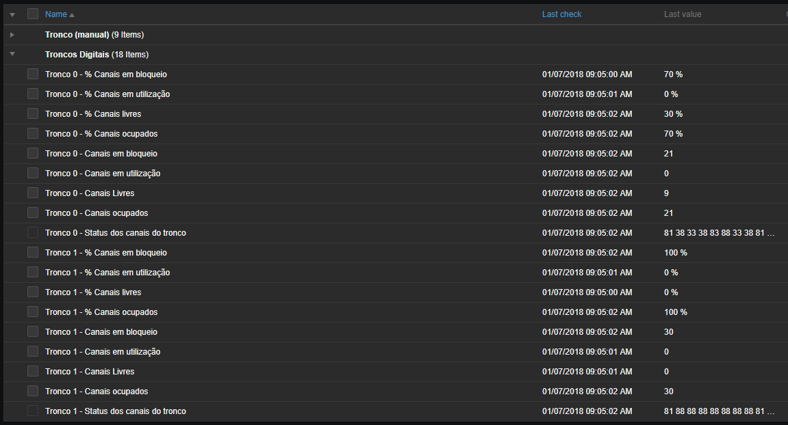

# Descrição:

Este script faz uma consulta SNMP para uma OID com o mapeamento dos canais do tronco E1 (acTrunkStatusChannels)
de Gateways AudioCodes Mediant 1000 e devolve parâmetros contábeis tais como:
   * Canais em uso
   * Canais em bloqueio
   * Canais livres.
Script para aplicação em Zabbix Server ou consulta individual em terminal linux (necessário pacote SNMP)

This script makes an SNMP query to an OID that contains E1 (or similar) trunk mapping channels (acTrunkStatusChannels)
of AudioCodes Mediant 1000 Gateways and returns accounting parameters such as:
* Channels in use
* Blocked channels
* Free channels.
Script for Zabbix Server application or individual query on linux terminal (SNMP package required)

> Autor: Alex Santos (IFRN) - alex.santos@ifrn.edu.br - Data:  29/12/2017

-----
De acordo com medições empíricas realizadas, existem dois padrões de exibição do uso dos canais no audiocodes:
   1. quando não existem canais sem bloqueio
   2. quando há canais com bloqueio
	 
 Exemplos de respostas da OID de acTrunkStatusChannels: 
   1. 133C333313333333
   2. 81 88 88 88 88 33 38 38 81 83 83 83 33 83 38 38
   
 **Utilização**
```
 # ./AudioCodes-ContaCanais.py <host_dns/host_ip> <comunidadeSNMP> <num_tronco> <parâmetro>
```
 **Parâmetros:**
```
 -c: exibe o mapeamento dos canais no tronco E1, no formato que o equipamento envia
 -l: retorna a quantidade de canais livres (sem ocupação)
 -u: retorna quantidade de canais em uso (ocupado com voz)
 -b: retorna quantidade de canais em bloqueio (ocupado com bloqueio de sinalização)
 -o: retorna quantidade de canais ocupados (ocupado com voz e ocupados com bloqueio)
 -t: exibe todas as informações acima
```
**Exemplos de uso no shell do linux**
```
# ./AudioCodes-ContaCanais.py 10.0.0.10 public 0 -t
   Canais:         1333333313333333
   Livres:         30
   Em Uso:         0
   Bloqueados:     0
   Ocupados (u+b): 0
```
_O parametro <num_tronco> será 0 caso só exista um tronco digital_

**Recomendação de discovery rule (Zabbix)**

_Incluir linha de UserParameter no Zabbix-agent.conf do Zabbix Server_

```
 UserParameter=E1.CanaisInfo[*], <caminho_do_script>./AudioCodes-ContaCanais.py $1 $2 $3 $4
```
**Exemplos de uso com Zabbix:**
```
 E1.CanaisInfo[{HOST.DNS},{$SNMP_COMMUNITY},{#SNMPINDEX},-l]
 E1.CanaisInfo[{HOST.DNS},{$SNMP_COMMUNITY},{#SNMPINDEX},-u]
 E1.CanaisInfo[{HOST.DNS},{$SNMP_COMMUNITY},{#SNMPINDEX},-b]
 E1.CanaisInfo[{HOST.DNS},{$SNMP_COMMUNITY},{#SNMPINDEX},-o]
```
Configurando descoberta SNMP


Itens recebidos com a descoberta SNMP

_*Porcentagem pode ser calculada com itens calculados._
